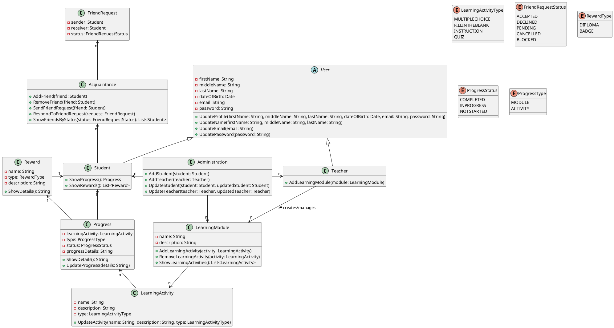

## 3. Technisch ontwerp.
### 3.a Class diagram.

![ClassDiagram](https://www.plantuml.com/plantuml/png/dLLHRwCu47xdLrXzEQfjTRfNjAgM0Dj5Io4No4btRrwOf9R0P6tJNdMw_tuE7YSOcaYzl11_y_7DD_Pu-28L5MheMiy3FdGa0oeuu_kmLko5gRVgxG3a7u_etzCsgz9rbaJVYZHAHkXhccLfNdrBLbcOVn-XD2-hpJQgqY8Vrxzlqx-yVr7zgs30cmty742gKb4rI1GFeoXPLqayBk8aqhAuM2TvdEQFu_yepACaop2ooehek_vlrJVmIaKpSHnhkyLJQCXX_9YSg6lHxmL8wNY8YYTTdZMHvkjDyRX9od9SvaLLLk56HnSYqpqgucsMO4LL-aTQ_Nca_q9ML0AfMoebsVM2r7tNzPmC4WIXIWdsOr0WFVf3Aa5hXSoj3gFm_Ou9gNBQGK1ApUTx0tUiQLfOuYrzZzrG1SLknOHw3aYi5mQ6ZhBMPHvq_jTUD0xwQNiuAkYwTwm5Vs7fZg0T1slfdBMmSKUi1MJCqzzEyskn_vlS5KgEINqdjHDVemj_QKSVgZcZiEaOPyTZKwpdU5gVmgOfrT00Lxuqpu0WS7jYL43hPn2-Ci-08E1uk2HpHuOntfIpWFFsfHIdjwjPO58P8WJ-Li2RSpUYUpifdlfcQC7lnaT0N7WYX_RUbIkV-rTxc_pRWDZ_vwYvssCmOr9zDkk7ixoRrzuQlhm286l13iV3SW9OaZFyV8f_0Z8FuIvleEjVu8FlOKcp48DpTVEtnZgnq7diuwNUApsmWdT7_RHtJjLmvqQvgWXUL9nq0CxdfL_7rcIANwi2zp06HLchDyw6pjbi3zbyxSpSqkx4XJFR3Ix7JqKm-tJWj4GCxLptkPodjlCRmvfE6HmozS-1Cguehs5o1StdrD-D3tS0sDQyIYarvdoIBqh9Gy-RgdV9mZm3ui2J3ZUuNBsPlV9n2rs-YTdEnyIJY-sGxM5A3O4u-JIWW1hOomA-alMOnHtWnpxPgVi7SiDlhCo28jZ-6JbsIYuuJV_AaUAE9izTkcgBbhIzCKO_6zKb2s_MpMzdpcc4shbxFnnC4gURFFH_nJ09I2s0Af2_TfJJFKZoO5MlfSIWsL2yrjuqzyIISpQUzqKlXgxz3m00)

