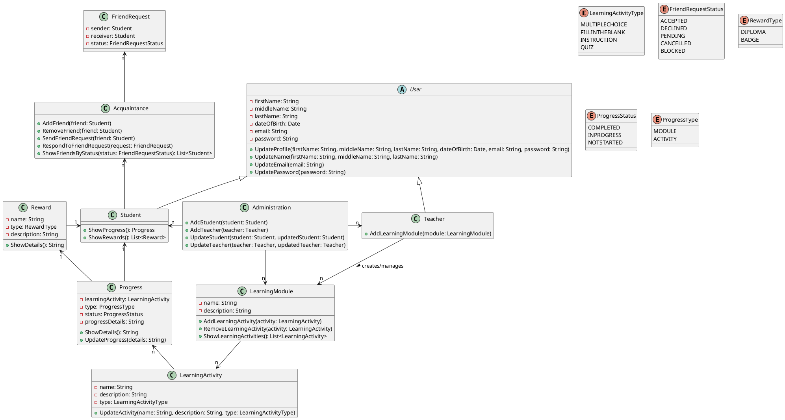

# Functioneel Ontwerp "LingoPartner" Taal Leer App

LingoPartner" is een taal leer app gericht op het Nederlandse examen voor sociale integratie, niveau A1 of A2. Het is ontworpen voor zowel families als vrienden en biedt activiteiten zoals interactieve spelletjes, invuloefeningen en multiple-choice vragen.

Dit document beschrijft het functioneel ontwerp van de "LingoPartner" app, inclusief een analyse van zelfstandige naamwoorden en werkwoorden, een conceptueel model, een use case diagram en een class diagram.

## 1. Casus:
LingoPartner" is een app voor het leren van talen, ideaal voor degenen die zich voorbereiden op het Nederlandse examen voor sociale integratie (Inburgering), gericht op niveau A1 of A2. Het is ontworpen om het leren van Nederlands aantrekkelijk te maken, niet alleen voor gezinnen maar ook voor vrienden. De app bevat activiteiten zoals interactieve spelletjes, invuloefeningen, multiple choice vragen, woorden vertalen, tekstbegrip, woordgebruik, toetsen en andere activiteiten  die helpen bij het leren van nieuwe woorden en zinnen, op maat gemaakt voor zowel familie- als vriendengroepen. De activiteiten zijn gericht op woordbegrip, grammatica en spelling. 

Een functie is de mogelijkheid voor gebruikers om vrienden uit te nodigen om deel te nemen aan het leertraject, waardoor een ondersteunende en leuke omgeving ontstaat. Gebruikers kunnen scores en voortgang vergelijken, waardoor een vriendelijk concurrentievoordeel aan de leerervaring wordt toegevoegd. Ook het behalen van een badge of diploma kan leuk zijn voor een competitieve leerervaring.

De inhoud kan door een docent worden aangeleverd. De inhoud is gestructureerd in collecties. Collecties bestaan uit hoofdstukken. Een hoofdstuk bestaat uit activiteiten binnen de app. Elke activiteit kan een score opleveren in de vorm van een cijfer. Wanneer de gebruiker een een hoofdstuk voldoende afrond, kan de gebruiker een badge verdienen. Het afronden van een collectie van hoofdstukken op voldoende niveau kan een diploma opleveren. 

Van de badges en diploma's kan de gebruiker een overzicht zien. Het overzicht kan men vergelijken met vrienden. Vrienden kunnen uitgenodigd worden om deel te nemen aan de activiteiten.
Per diploma kan men een voortgangs indicator zien. 

De app past zich aan het individuele leertempo aan via de functie voor voortgangsregistratie. Integratie in het dagelijkse leven moedigt gebruikers aan om Nederlands te gebruiken bij routinematige activiteiten, waardoor de praktische taalvaardigheden worden vergroot. Binnen de activiteiten word een aantal getracked op a1, b1 niveau, onderwerp. 

De taaluitwisselingsmodule verbindt leerlingen met moedertaalsprekers en biedt de mogelijkheid om contact te leggen met anderen. Zo kan men een afspraak maken plannen met een taalmaatje, of een videocall inplannen. 

Samenvattend is "LingoPartner" meer dan een leermiddel; het is een platform om contact te maken met anderen, of het nu familie of vrienden zijn, met als gemeenschappelijk doel taalvaardigheid, waardoor de reis naar het beheersen van het Nederlands interactief en plezierig wordt.

## 2. Functioneel ontwerp. 
### 2.a Noun - verb analysis. 
> Deze zelfstandige naamwoorden en werkwoorden een compleet beeld van een veelzijdige, interactieve taalleerapplicatie, ontworpen om gebruikers op een effectieve en aangename manier Nederlands te leren, met nadruk op zowel theoretische kennis als praktische toepassing.

#### Nouns analysis: 
> De zelfstandige naamwoorden omschrijven de sleutelcomponenten en gebruikers van de app. Ze omvatten niet alleen de basis elementen zoals 'App', 'Applicatie', en 'Talen', maar ook specifieke aspecten zoals 'Activiteiten', 'Spelletjes', en 'Invuloefeningen', die wijzen op interactieve en educatieve onderdelen binnen de app. Belangrijke gebruikersgroepen zoals 'Gebruikers', 'Vrienden', en 'Families' worden benoemd, wat aangeeft dat de app zich richt op individueel én groepsleren. 'Scores', 'Voortgang', en 'Badges' duiden op een systeem van voortgangsbewaking en motivatie. Meer geavanceerde functies zoals de 'Taaluitwisselingsmodule' en 'Videocall' benadrukken interactie en praktische toepassing van de taal.

- **App (Applicatie)**: Een softwaretoepassing voor het leren van talen.
- **Families**: Groepen familieleden die gezamenlijk Nederlands leren met behulp van de app.    
- **Talen**: De talen die geleerd kunnen worden, in dit geval Nederlands.
- **Examen**: Een specifieke toets of beoordeling, zoals het Nederlandse examen voor sociale integratie.
- **Niveau**: Vaardigheidsniveaus in een taal, hier A1 of A2.
- **Activiteiten**: Verschillende interactieve oefeningen binnen de app om taal te leren.
- **Spelling**: De manier waarop Nederlandse woorden correct worden geschreven.    
- **Spelletjes**: Educatieve games in de app om taalvaardigheden op een leuke manier te oefenen.
- **Invuloefeningen**: Oefeningen waarbij gebruikers woorden of zinnen moeten aanvullen.
- **Multiple Choice Vragen**: Vragen met meerdere antwoordkeuzes ter beoordeling van taalkennis.
- **Woorden**: Individuele vocabulaire-items die geleerd worden.
- **Tekstbegrip**: Het vermogen om geschreven taal te begrijpen en te interpreteren.
- **Woordgebruik**: Het correct en gepast gebruiken van woorden in zinnen.
- **Toetsen**: Testen of beoordelingen om de voortgang in taalvaardigheid te meten.
- **Gebruikers**: Personen die de app gebruiken om talen te leren.
- **Vrienden**: Andere gebruikers van de app met wie men kan samenwerken of concurreren.
- **Scores**: Punten of beoordelingen verkregen voor prestaties binnen de app.
- **Badge**: Een digitale erkenning of beloning voor het bereiken van bepaalde mijlpalen.
- **Diploma**: Certificaat of bewijs van het succesvol afronden van een cursus of niveau.
- **Inhoud**: Educatief materiaal of lessen aangeboden in de app.
- **Docent**: De persoon die educatieve inhoud voor de app levert of creëert.
- **Collecties**: Verzamelingen van gerelateerde educatieve content binnen de app.
- **Hoofdstukken**: Onderdelen of secties binnen een collectie in de app.
- **Voortgang**: De vooruitgang van een gebruiker in het leren van de Nederlandse taal binnen de app.    
- **Voortgangsregistratie**: Het systeem binnen de app dat bijhoudt hoe ver een gebruiker gevorderd is in het leerproces.    
- **Voortgangsindicator**: Tool om de vooruitgang van de gebruiker in de app te volgen.
- **Leertempo**: De snelheid waarmee een gebruiker nieuwe informatie leert en verwerkt.
- **Taalvaardigheid**: De mate van beheersing en competentie in een taal, in dit geval Nederlands.
- **Taalvaardigheden**: De bekwaamheid in het spreken, schrijven, luisteren, en lezen in een taal.
- **Moedertaalsprekers**: Mensen voor wie Nederlands de moedertaal is en die als taalpartners kunnen dienen in de app.
- **Taaluitwisselingsmodule**: Een onderdeel van de app dat gebruikers verbindt met moedertaalsprekers voor praktijkgerichte taaluitwisseling.
- **Taalmaatje**: Een partner om mee te oefenen in de taaluitwisselingsmodule.
- **Videocall**: Video-oproepfunctie voor live gesprekken binnen de app.
- **Platform**: De digitale omgeving of infrastructuur van de app.

#### Verb analysis:
> De werkwoorden beschrijven de acties en doelstellingen van de app. 'Voorbereiden', 'Leren', en 'Helpen' geven de primaire functies aan: educatie en ondersteuning bij het leren van Nederlands. 'Maken' en 'Bevatten' verwijzen naar de opbouw van de app met diverse leermaterialen en oefeningen. 'Uitnodigen', 'Deelnemen', en 'Vergelijken' suggereren sociale interactie en competitieve elementen. 'Behalen' en 'Volgen' duiden op het bereiken van mijlpalen en het persoonlijk volgen van een leertraject. 'Aanpassen' en 'Integreren/Encouragen' wijzen op de flexibiliteit van de app en de nadruk op praktische toepassing van de taal in het dagelijks leven. 'Verbinden' en 'Plannen/Inplannen' belichten de mogelijkheid om te interageren met moedertaalsprekers en persoonlijke leerervaringen te organiseren.

- **Integreren**: De app integreert taalgebruik in het dagelijks leven en moedigt praktische toepassing aan.    
- **Leren**: Het hoofddoel van de app, waarbij gebruikers Nederlands leren.    
- **Bevatten**: De app omvat verschillende soorten leermateriaal en oefeningen.    
- **Aanleveren/Structureren**: Docenten leveren en structureren de inhoud van de app.    
- **Volgen**: Gebruikers kunnen hun eigen leerpad volgen door hoofdstukken.    
- **Voorbereiden**: Het proces van studeren of trainen voor het Nederlandse examen.
- **Ontworpen**: Het creëren of structureren van de app met een bepaald doel.
- **Maken**: In deze context, het aantrekkelijk maken van het leerproces.
- **Bevat**: Het hebben of omvatten van bepaalde elementen of functies in de app.
- **Helpen**: Het bieden van ondersteuning of vergemakkelijking in het leerproces.
- **Gericht zijn op**: De focus of doelstelling van de app richten op specifieke vaardigheidsniveaus.
- **Uitnodigen**: De actie van gebruikers om anderen aan te moedigen deel te nemen.
- **Deelnemen**: Actief betrokken zijn bij het leerproces of activiteiten.
- **Ontstaan**: Het tot stand komen of vormen van een omgeving of situatie.
- **Vergelijken**: Het beoordelen of evalueren van prestaties ten opzichte van anderen.
- **Toevoegen**: Het introduceren van nieuwe elementen of aspecten in de ervaring.
- **Behalen**: Het succesvol voltooien of verkrijgen van een doel, zoals een badge of diploma.
- **Aangeleverd worden**: Het verstrekken of bezorgen van educatieve inhoud door een docent.
- **Bestaan uit**: Samengesteld zijn of gevormd worden door bepaalde elementen.
- **Opleveren**: Resulteren in of het verkrijgen van iets, zoals een score.
- **Afronden**: Het voltooien of afmaken van een hoofdstuk of collectie.
- **Verdienen**: Het ontvangen van een beloning of erkenning voor prestaties.
- **Zien**: Het visueel waarnemen of bekijken van informatie, zoals scores of voortgang.
- **Uitgenodigd worden**: Het ontvangen van een uitnodiging om deel te nemen.
- **Aanpassen**: Het wijzigen of personaliseren van de app naar het leertempo van de gebruiker.
- **Moedigen aan**: Het stimuleren of bevorderen van bepaald gedrag, zoals het gebruik van Nederlands.
- **Worden vergroot**: Het toenemen of verbeteren van vaardigheden.
- **Getracked worden**: Het volgen of monitoren van activiteiten of prestaties.
- **Verbinden**: Het tot stand brengen van een relatie of connectie tussen gebruikers.
- **Leggen**: Het maken van een connectie of het initiëren van communicatie.
- **Maken**: In deze context, het plannen of organiseren van afspraken of videogesprekken.
- **Inplannen**: Het vaststellen of organiseren van een bepaalde activiteit op een specifiek moment.
- **Samenvatten**: Het beknopt overzien of beschrijven van de essentie van de app.

### 2.b Conceptueel model. 
Ik heb een kleine analyse gemaakt van zelfstandige naamwoorden en werkwoorden die in de casus voorkomen. Deze zal ik hieronder benoemen en later zal ik de belangrijkste onderdelen van de "LingoPartner" app en hoe ze samenwerken in een conceptueel model weergeven.

#### Entiteiten (Zelfstandige Naamwoorden):
- **Gebruikers**: Centraal in het model, omvatten individuen, families, vrienden en taalmaatjes.    
- **Leeractiviteiten**: Hieronder vallen interactieve spelletjes, invuloefeningen, multiple choice vragen, Taaluitwisselingsmodule, etc., gericht op verschillende taalaspecten zoals woordbegrip, grammatica en spelling.    
- **Educatieve Inhoud**: Bestaande uit collecties en hoofdstukken, aangeleverd en gestructureerd door docenten. Deze inhoud vormt de basis voor de leeractiviteiten.    
- **Voortgang**: De voortgang van gebruikers in het leerproces, inclusief scores, badges, diploma's en voortgangsindicatoren.
- **Beloningen**: Badges en diploma's. Dit systeem motiveert gebruikers door het zichtbaar maken van hun voortgang.    
- **Sociale Interactie**: Mogelijkheden voor gebruikers om vrienden uit te nodigen en deel te nemen aan leeractiviteiten, evenals het vergelijken van scores en voortgang.    
- **Taaluitwisselingsmodule**: Verbindt gebruikers met moedertaalsprekers voor praktische taaloefeningen, waaronder het plannen van afspraken of videocalls.    
- **Voortgangsregistratie**: Houdt de voortgang van gebruikers bij, waardoor het leerverloop op individuele basis gevolgd kan worden.    
- **Platform**: De digitale omgeving waarbinnen al deze componenten functioneren.

#### Relaties (Werkwoorden):
- **Integreren**: De app integreert Nederlands in het dagelijks leven van gebruikers, wat bijdraagt aan de ontwikkeling van praktische taalvaardigheden.
- **Leren**: Gebruikers leren Nederlands door interactieve activiteiten en oefeningen die door de app worden aangeboden.
- **Bevatten en Aanleveren/Structureren**: De app bevat een breed scala aan educatief materiaal, gestructureerd en aangeleverd door docenten, waardoor een solide leerbasis wordt geboden.
- **Volgen**: Gebruikers kunnen hun eigen leerpad volgen door middel van gestructureerde hoofdstukken en collecties, wat leidt tot een gepersonaliseerde leerervaring.
- **Voorbereiden**: De app bereidt gebruikers voor op het Nederlandse inburgeringsexamen door gerichte inhoud en oefeningen aan te bieden.
- **Maken, Helpen, Gericht Zijn Op**: De app is ontworpen om het leerproces aantrekkelijk te maken en helpt gebruikers door zich te richten op specifieke vaardigheidsniveaus (A1 of A2).
- **Uitnodigen en Deelnemen**: Gebruikers kunnen vrienden uitnodigen om deel te nemen aan de leerervaring, wat zorgt voor interactie en samenwerking.
- **Vergelijken, Toevoegen, Behalen, Verdienen**: Gebruikers kunnen scores en voortgang vergelijken met vrienden, wat een element van competitie toevoegt. Het behalen van badges en diploma's wordt een motiverende factor.
- **Zien en Worden Uitgenodigd**: Gebruikers kunnen hun voortgang en behaalde badges/diploma's zien. Ze kunnen ook worden uitgenodigd door anderen om deel te nemen aan leeractiviteiten.
- **Aanpassen**: De app past zich aan het individuele leertempo van elke gebruiker aan, wat bijdraagt aan een effectievere en persoonlijke leerervaring.
- **Aanmoedigen en Worden Vergroot**: De app moedigt gebruikers aan om Nederlands te gebruiken in hun dagelijks leven, waardoor hun taalvaardigheden worden vergroot.
- **Getracked Worden**: De voortgang van de gebruiker op verschillende niveaus en onderwerpen wordt gevolgd, wat helpt bij het identificeren van leergebieden en vooruitgang.
- **Verbinden, Leggen, Maken, Inplannen**: De taaluitwisselingsmodule stelt gebruikers in staat om verbindingen te leggen met moedertaalsprekers, wat leidt tot praktische taaloefening. Gebruikers kunnen afspraken en videocalls plannen voor verdere taalpraktijk.
- **Samenvatten**: Ten slotte, "LingoPartner" wordt samengevat als een platform dat niet alleen dient als een leermiddel maar ook als een manier om contact te maken met anderen, wat de taalleerervaring verrijkt en verbreedt.

### 2.c Conceptueel model. 
Het conceptuele model hieronder laat de belangrijkste onderdelen van de "LingoPartner" app en hoe ze samenwerken zien open visuele manier. Dit omvat gebruikers, soorten leeractiviteiten, lesmateriaal, hoe ver iemand is met leren, beloningen, manieren om met anderen te communiceren, een speciaal deel voor taaluitwisseling, en hoe de app de voortgang van een gebruiker volgt. Het laat zien hoe al deze delen samen een app vormen die op een leuke en nuttige manier helpt bij het leren van Nederlands, met aandacht voor zowel theorie als praktijk.

```plantuml
@startuml
rectangle Leerling
rectangle Leerkracht
rectangle Vriend
' rectangle EducatieveInhoud as "Educatieve Inhoud"
' rectangle Collectie
' rectangle Hoofdstukken
rectangle Leeractiviteit
rectangle Voortgang
rectangle Beloning
' rectangle Diploma
' rectangle Badge
' rectangle SocialeInteractie as "Vriendenlijst"
' rectangle LeerlingDashboard as "Leerling Dashboard"

Leerkracht "1..n" -down-> "1..n" Leeractiviteit : levert
' EducatieveInhoud -down-> Collectie : bestaat uit
' Collectie -right-> Hoofdstukken : omvat
' Hoofdstukken -down-> Leeractiviteit : bevat
' EducatieveInhoud "1" -down-> "1..n" Leeractiviteit : bevat

Leerling "1" -left-> "1..n" Leeractiviteit : "neemt deel aan\n/ voert uit"
Leerling "1" -right-> "0..n" Vriend  : heeft
' Leerling "1" -down-> "1" LeerlingDashboard : heeft
Leeractiviteit "1" -down-> "1" Voortgang : levert
Voortgang "1" -up-> "1" Leerling : heeft
Leerling "1" -down-> "1..n" Beloning : heeft
Voortgang "1" -right-> "1..n" Beloning : heeft
' Diploma "1" -up-> "n" Voortgang : heeft
' Badge "1" -up-> "1" Voortgang : heeft
' Beloning "1..n" -up-> "1" Diploma : is
' Beloning "1..n" -up-> "1" Badge : is
' Beloning "n" -right-> "1" LeerlingDashboard : toont
@enduml
</details>

### 2.d Use case diagram.
#### Actoren:
- **Leerling**: _De gebruiker van de app, die deelneemt aan leeractiviteiten, voortgang maakt, beloningen verdient, en communiceert met vrienden en taalmaatjes._
- **Leerkracht**: _De leverancier van educatieve inhoud, die collecties en hoofdstukken aanmaakt en aanlevert._
- **Vriend**: _Een andere gebruiker van de app, met wie de leerling scores en voortgang kan vergelijken, en met wie de leerling kan communiceren._
- **Admin**: _Een beheerder van de app, die gebruikersaccounts kan aanmaken en beheren._

#### Usecases: 

- **Gebruiker Aanmaken**: _Een nieuwe gebruiker maakt een account aan om de app te gebruiken._
- **Profiel Aanpassen**: _Een gebruiker past zijn of haar profiel aan, inclusief persoonlijke informatie en voorkeuren._
- **Collectie aanmaken**: _Een leerkracht maakt een nieuwe collectie aan, bestaande uit verschillende hoofdstukken._
- **Leeractiviteit Aanmaken**: _Een leerkracht maakt een nieuwe leeractiviteit aan, die deel uitmaakt van een hoofdstuk._
- **Voortgang bekijken**: _Een leerling, leerkracht of vriend bekijkt zijn of haar voortgang, inclusief scores, badges, diploma's en voortgangsindicatoren._
- **Leeractiviteit Uitvoeren**: _Een leerling voert een leeractiviteit uit, zoals een interactief spel, invuloefening of multiple choice vraag._
- **Woorden Leren**: _Een leerling leert nieuwe woorden en zinnen door middel van educatieve activiteiten._
- **Invuloefening en Meerkeuzevraag Uitvoeren**: _Een leerling voert een invuloefening of meerkeuzevraag uit als onderdeel van een leeractiviteit._
- **Reeds Gestarte Collectie Hervatten**: _Een leerling hervat een collectie die eerder is gestart, om de voortgang voort te zetten._
- **Voortgang Delen met Vrienden**: _Een leerling deelt zijn of haar voortgang met vrienden, om scores en badges te vergelijken._

![Usecase Diagram](https://www.plantuml.com/plantuml/png/VPBVIyCm4CVVyrSSUo_eVWz49XEcC648cy-tzjR5fib8hdrG_DzDNRT5KtnhFldasyjTvexHSbKgeMZFm0Qip0yCcRIKiZHQOCh6maDMolFtYiWggVDskRMIT1Ri5HRJ0mlH9A3E5K5lvNMpHikQVDRns8DF0L0vIj7vxINjR2MBPWzrYGNf7g23pU8sjDRMx2MfnZcYSnUf7qeBerHJEG7-ZXg4LbCcUgkMJ9B__dKOgbjZBEV-7h2ZGhvVhT4_WHl9jI5xSSUX--OJCzAm2eH9A3phkbA6zgHzsy2RBqrNgVgWsYBcKVeqFFnAb3bOqizW2QxzU29R8_FbrApxbe-aI4D9t0xsEeiR8U3q4219xjlfd1z3Y_en6iLe7AD9ZAOnciN8bmN1iplJBjZlWeCkEEo2_Y9jJs9mboIdMhx4tA-hKdq3)

<details>

```plantuml
@startuml
left to right direction
actor Admin
actor Leerling
actor Vriend
actor Leerkracht

rectangle "LingoPartner App" {
  usecase "Gebruiker Aanmaken" as UC1
  usecase "Profiel Aanpassen" as UC2
  usecase "Collectie aanmaken" as UC3
  usecase "Leeractiviteit Aanmaken" as UC4
  usecase "Voortgang bekijken" as UC5
  usecase "Leeractiviteit Uitvoeren" as UC6
  usecase "Woorden Leren" as UC7
  usecase "Invuloefening en Meerkeuzevraag Uitvoeren" as UC8
  usecase "Reeds Gestarte Collectie Hervatten" as UC9
  usecase "Voortgang Delen met Vrienden" as UC10

  Admin --> UC1
  Leerling --> UC2
  Leerling --> UC5
  Leerling --> UC6
  Leerling --> UC7
  Leerling --> UC8
  Leerling --> UC9
  Leerling --> UC10
  Leerkracht --> UC1
  Leerkracht --> UC2
  Leerkracht --> UC3
  Leerkracht --> UC4
  Leerkracht --> UC5
  Vriend --> UC5
  Vriend <-- UC10
}
@enduml
```

## 3. Technisch ontwerp.
### 3.a Class diagram.

![ClassDiagram](https://www.plantuml.com/plantuml/png/dLLHRwCu47xdLrXzEQfjTRfNjAgM0Dj5Io4No4btRrwOf9R0P6tJNdMw_tuE7YSOcaYzl11_y_7DD_Pu-28L5MheMiy3FdGa0oeuu_kmLko5gRVgxG3a7u_etzCsgz9rbaJVYZHAHkXhccLfNdrBLbcOVn-XD2-hpJQgqY8Vrxzlqx-yVr7zgs30cmty742gKb4rI1GFeoXPLqayBk8aqhAuM2TvdEQFu_yepACaop2ooehek_vlrJVmIaKpSHnhkyLJQCXX_9YSg6lHxmL8wNY8YYTTdZMHvkjDyRX9od9SvaLLLk56HnSYqpqgucsMO4LL-aTQ_Nca_q9ML0AfMoebsVM2r7tNzPmC4WIXIWdsOr0WFVf3Aa5hXSoj3gFm_Ou9gNBQGK1ApUTx0tUiQLfOuYrzZzrG1SLknOHw3aYi5mQ6ZhBMPHvq_jTUD0xwQNiuAkYwTwm5Vs7fZg0T1slfdBMmSKUi1MJCqzzEyskn_vlS5KgEINqdjHDVemj_QKSVgZcZiEaOPyTZKwpdU5gVmgOfrT00Lxuqpu0WS7jYL43hPn2-Ci-08E1uk2HpHuOntfIpWFFsfHIdjwjPO58P8WJ-Li2RSpUYUpifdlfcQC7lnaT0N7WYX_RUbIkV-rTxc_pRWDZ_vwYvssCmOr9zDkk7ixoRrzuQlhm286l13iV3SW9OaZFyV8f_0Z8FuIvleEjVu8FlOKcp48DpTVEtnZgnq7diuwNUApsmWdT7_RHtJjLmvqQvgWXUL9nq0CxdfL_7rcIANwi2zp06HLchDyw6pjbi3zbyxSpSqkx4XJFR3Ix7JqKm-tJWj4GCxLptkPodjlCRmvfE6HmozS-1Cguehs5o1StdrD-D3tS0sDQyIYarvdoIBqh9Gy-RgdV9mZm3ui2J3ZUuNBsPlV9n2rs-YTdEnyIJY-sGxM5A3O4u-JIWW1hOomA-alMOnHtWnpxPgVi7SiDlhCo28jZ-6JbsIYuuJV_AaUAE9izTkcgBbhIzCKO_6zKb2s_MpMzdpcc4shbxFnnC4gURFFH_nJ09I2s0Af2_TfJJFKZoO5MlfSIWsL2yrjuqzyIISpQUzqKlXgxz3m00)

