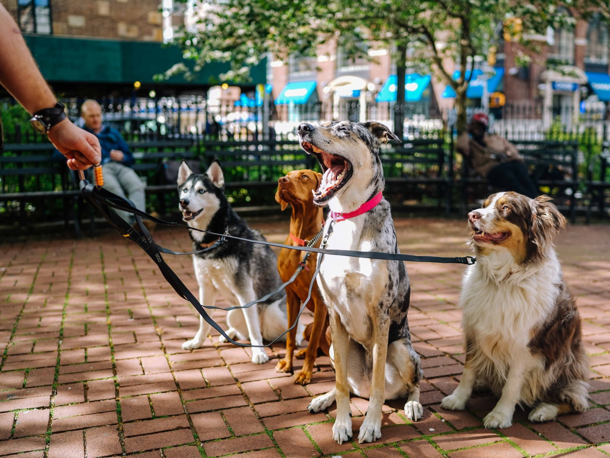
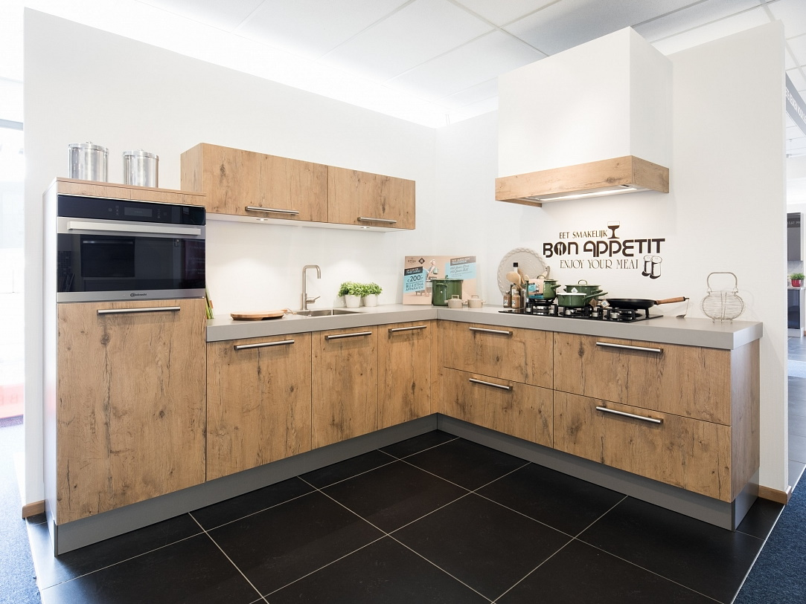
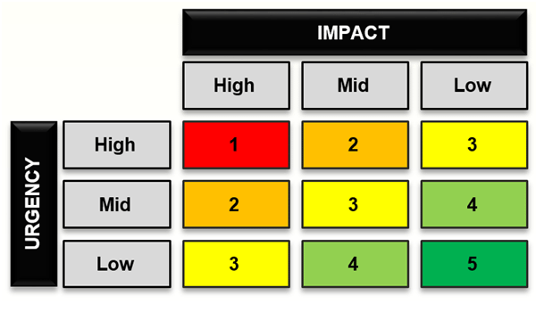

# Showcase Assignments Pool (Associate Degree)

In case you enrolled in the Associate Degree program **you may** pick a pre-existing showcase assignment from the pool below. In case you enrolled in the Bachelor Degree program **you may not** pick a pre-existing assignment from this pool and should find a showcase assignment from an external client. Please refer to the page "Showcase" for more information.

## Case 1 Dog walking service

The dog walking service "Barking Rakkers" is starting to grow exponentially. It once started as an outgrown hobby of the owner of the service who walked all the dogs in the neighborhood herself, but has now expanded to such an extent that it now employs staff and allows customers to make reservations for when their dog is walked. should be done in the future. The owner of the exhaust service now spends every evening preparing the schedule for the next day. Consider the dogs that have already been reserved, but also consider leaving some space in the schedule for dogs that need to be picked up in the morning or afternoon of the day itself. In addition, there are now staff employed, so a daily plan must be made for each staff member, indicating when which dog should be walked. And to make things even more complicated, customers are also starting to become more demanding and indicate at which address their dog should be picked up, and at which address and before what time their dog should be returned. Planning a day of dog walking is now a lot of work, as not all staff work every day, and some dogs are walked at a lower level than other dogs, depending on the customer's wishes. So it is sometimes quite a puzzle to divide the dogs to be walked among the available staff, and the owner would like an application that can do this for her.

## Case 2 The kitchen giant

The local kitchen giant has a great idea, customers can now put together a kitchen from home! How does it work? The customer measures the available space in the house, which is then divided into sections of 90, 60 and 45 cm wide, such as the kitchen cabinets under the sink. An example: an L-shaped kitchen has a length of 195 cm on the long part and 120 cm on the short part. On the short section it is reasonable to opt for 2 components of 60cm. However, on the long piece the customer could choose 3 components of 60cm (together 180cm) and then an edge of 15cm remains, but it is also possible to choose 1 component of 90cm and then 1 of 60cm and 1 of 45cm, together 195cm, then there is nothing left and it fits exactly. The disadvantage is that ovens, for example, are not available in 45cm format, and dishwashers are not available in 90cm. So depending on the customer's choices, one layout may be more favorable than another. The customer must be able to specify the lengths of the kitchen and put together a layout. In the event that the customer puts together a layout with a leftover piece (see above), the application must warn when an alternative layout fits exactly (see above). The customer can of course ignore the warning. In addition to the aforementioned restriction on sizes, an oven and a refrigerator may not be placed next to each other, and in each composition there must be at least 1 kitchen cabinet of 60cm because the sink must be mounted above it. The kitchen giant has asked you to develop an application for them that customers can use themselves to help with this.

## Case 3 Cultural Stage

Cultural stage "Party - Sleep - Repeat" organizes concerts and stand-up comedy nights. They follow the recent trend and offer events that can be attended online or physically. In both cases, the number of visitors to the event is limited and varies per event. A person who wants to attend an event can purchase a ticket. A single ticket can give 1 or more people access to a single event. The stage is very customer-friendly and checks when a customer orders a ticket whether the event does not overlap with an event for which a ticket has already been purchased by that customer, and informs him or her if this is the case. Each event has an entrance fee per person. A service fee will be charged for each event per ticket; These can also differ per event. When a customer orders the ticket, the ticket invoice must be shown to the customer. However, this invoice must take into account the following discount scheme: if a ticket is ordered for

- an online event that gives access to more than 4 people, a discount of 5% on the admission price applies to the number of people above 4. If the event takes place on the customer's birthday, an additional discount of 1 euro will be given on the total price.
- a physical event, the service costs are halved if the event takes place within 24 hours. If the event takes place on the customer's birthday, the entrance fee for one person will be reduced by 5%.

## Case 4 Incidents & Changes

At a helpdesk of a large company, users can report so-called incidents if they experience problems with a software application. In addition, they can also submit change requests if they need a specific new feature in a software application. An impact is determined when incidents and changes are entered. This happens as follows:

- The impact of an incident linked to an application with 500 or more users: High
- The impact of an incident linked to an application with between 100 and 500 users: Medium
- The impact of an incident linked to an application with 100 or fewer users: Low
- The impact of a change is always: Low

When submitting an incident or change, the user can indicate an urgency. He or she can choose from: High, Medium, Low. The combination of urgency and impact determines the priority of the ticket:

When resolving an incident, a number of steps are always taken: analysis, design, implementation, test and deploy. For each step, a record is kept of how much time was spent on this step and when this step was completed.

  
A Service Level Agreement (SLA) is linked to an application. This SLA determines the time within which an incident must be resolved after the incident has been reported, based on the priority. The director of the company wants to be able to view a report that provides insight into:

- The outstanding change requests and their priorities
- The outstanding incidents
- What percentage of incidents meet the SLA