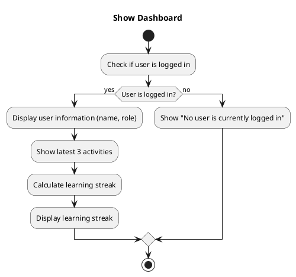

# Idea for algorithm

## Define Dashboard Requirements:
-   Display general user information (name and role).
-   Show the latest 3 items the user was working on.
-   Calculate and display the learning streak.
## Design the Dashboard:
-   Create a `Dashboard` class that will be responsible for gathering and displaying the necessary information.
-   Use design patterns such as the **Facade Pattern** to simplify interaction with the underlying data repositories.
## Implement the Dashboard:
-   Implement methods to gather the required data.
-   Create algorithms to calculate the learning streak.
## Extendibility:
-   Ensure the `Dashboard` class is modular and methods are well-defined.
-   Use interfaces and dependency injection to make the dashboard easily extendible.

## Making the Code Extensible with design patterns:

### IDEA 1: Dependency injection. 

-   **Interfaces and Dependency Injection:** Continue using interfaces and dependency injection to keep your code modular and testable.

_I already created some interfaces and used dependency injection in the previous tasks. I think it is not neccesary anymore to mention it here._

### IDEA 2: Facade Pattern

-   **Facade Pattern:** We'll create a DashboardFacade class that simplifies interactions with various services to gather and present the necessary data.
The `Dashboard` class acts as a facade to simplify interactions with the underlying system. 
(this looks a bit like the LearningActivityList class, but it is a bit different because it is not only a list of activities, but also a list of the latest activities and the streak)

-   **Factory Pattern:** i can use a factory to create instances of our streak calculators, making it easy to switch between different implementations if needed.
Use a factory pattern if the creation logic for certain objects becomes complex.
- What is i want to have the latest streak? 
- What if i want to calculate points generated by streaks? 
- What if i want to calculate the longest streak?

-   **Strategy Pattern:** For different calculation strategies (like different streak rules), consider the strategy pattern.

Do i use a form of composition? 
-  **Composition:** Use composition to build complex objects from simpler ones. For example, the `Administration` class may contain a `Dashboard` object to display user information.

### Points for improvement: 

schooladminstration: 
managing users, learning modules, and learning activities does not sound exactly like a good example of single reponsibility. 
-   **Single Responsibility Principle:** Refactor the `SchoolAdministration` class to ensure it has a single responsibility. Consider splitting it into separate classes for managing users, learning modules, and learning activities.
-   **Open/Closed Principle:** Make the `SchoolAdministration` class open for extension but closed for modification. Use interfaces and abstract classes to define common behavior and allow for easy extension.
 
-   **Observer Pattern:** Implement the observer pattern to notify the dashboard when new learning activities are added or updated.
-   **Decorator Pattern:** Use the decorator pattern to add additional functionality to the dashboard, such as displaying user achievements or progress.
-   **Command Pattern:** Implement the command pattern to encapsulate actions that can be undone or redone, such as updating user information or learning activities.

i have a userList, a userAdd and in the LingoPartnerConsole.Views namespace. Maybe i can combine these together? Is this like a facade pattern?

# intro. 
## problem statement
I would like to implement a new feature for my c# project. The domain layer you can see above in plantuml code. 

I want to create a dashboard that will show a learning streak out of progress data from the progress table. 
The dashboard will show 

The progress will be used to create a list or something to iterate through and check if there was a learning streak.

With this "list of streaks" i would like to calculate a score for the user. The longer the streak the higher the score.
I want to be able to retrieve the latest streak and the longest streak.
i want to be able to retrieve the current streak.
i want to be able to retrieve the total score.

There are a few things i think i need to create:
- A new class for learning streaks. 
- StreakCalculator Class
- Strategy Interface
- different implementations of the streak calculation strategy.

I am wondering what strategies i can can use:
- Strategy Pattern: To handle different streak calculation strategies.
- Iterator Pattern: To traverse the list of progress records.

i also have an algorithm for the dashboard. 

# Requirements Breakdown
- Calculate the total points from learning streaks.
- Get the last streak.
- Get the first streak.
- Get the total points generated by all streaks.
- Get the total points of the last streak.
# Suggested Approach
- Use a list of progress items to generate streak items.
- Maintain a separate list for streak items.
- Calculate streaks by iterating over the progress items list.
# Design Patterns to Use
- Strategy Pattern: To handle different streak calculation strategies.
- Iterator Pattern: To traverse the list of progress records.

I am wondering if you can help me out with this.
What do you think of my ideas? Are they any good? Or am i missing something? 
The code needs to be modular and consist out of best practices. 