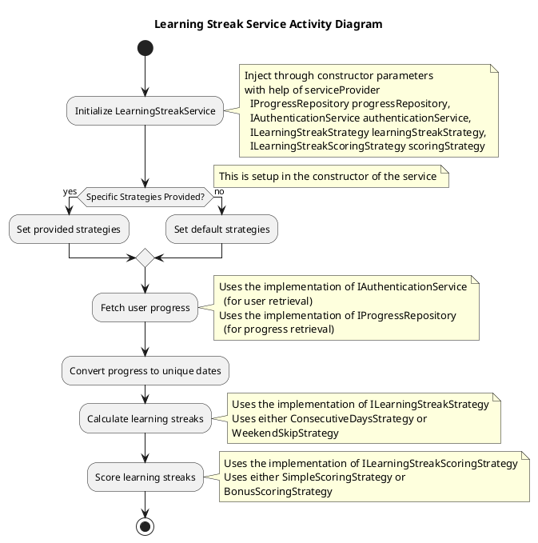
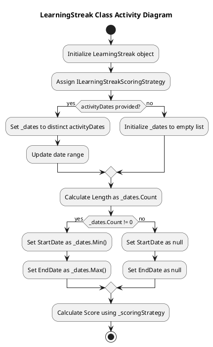
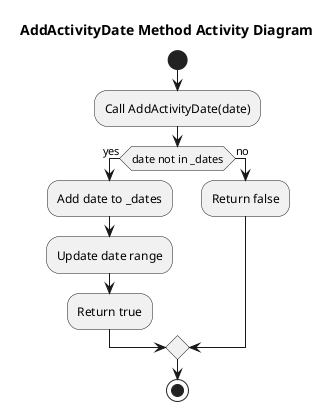
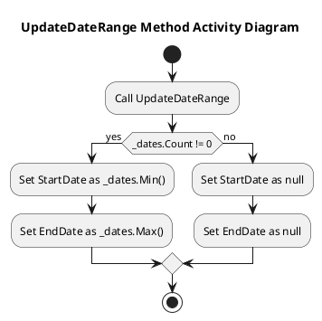
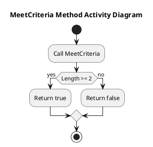
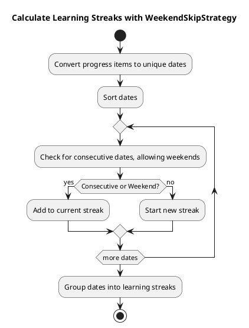
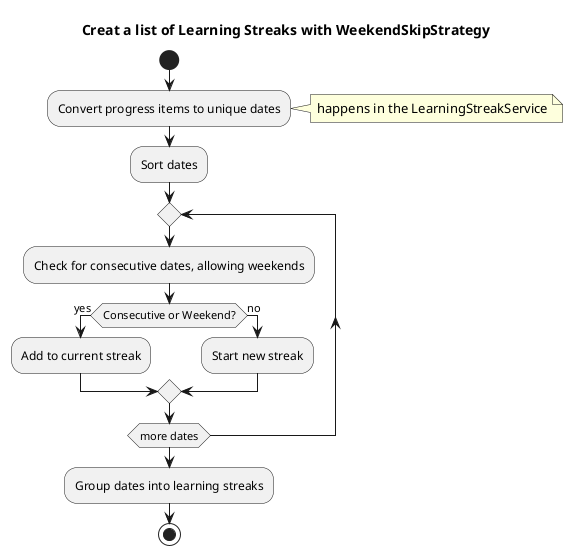
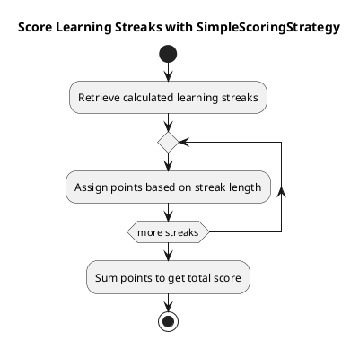
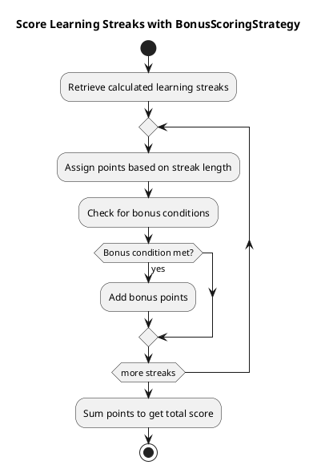

# THE LEARNING STREAK ALGORITHM
In de volgende paragraaf wordt de interne werking van het algoritme uitgelegd. Ik heb een specifieke service voor dit algoritme gemaakt, genaamd '***LearningStreakService***'. Ik dacht dat het een goed idee zou zijn om een ​​specifieke klasse te hebben die verantwoordelijk is voor het learning streak-algoritme.

Het heeft een paar ingrediënten nodig om goed te kunnen werken: het moet de gebruiker kennen, het moet weten wanneer (niet noodzakelijkerwijs precies wat) een gebruiker interactie had of activiteiten deed met de app. Wanneer een gebruiker iets doet, wordt dit in de database bijgehouden in de voortgangstabel. (Ja, we houden je in de gaten, maar alleen omwille van het algoritme). Om het simpel te houden, zijn we alleen geïnteresseerd in de datum van de interactie en maken we indien nodig een lijst met unieke data.

Terwijl we gebruik maken van de serviceprovider, kunnen we de ***ProgressRepository*** en de ***UserAuthenticationService*** injecteren om de benodigde gegevens te verkrijgen. Ik vind dit soort abstracties wel leuk. Voor het gebruiksgemak heb ik dit als toelichting in het diagram vermeld.

## LearnignStreakService
Ik wil graag één plek hebben die verantwoordelijk is voor _"leerresultaten"_. Dit is de reden waarom ik de LearningStreakService heb gemaakt. Deze dienst is verantwoordelijk voor het berekenen van de leerreeksen en het scoren ervan.

We kunnen de progressRepository en userAuthenticationService in de constructor van de LearningStreakService injecteren en we hoeven ons geen zorgen te maken over hun exacte implementatiedetails; de interne werking wordt beschreven in interfaces. Klinkt dat niet leuk?

Ik heb alles samengebracht in een activiteitendiagram. Dit diagram toont de stappen die de LearningStreakService neemt om de leerreeksen te berekenen en te scoren. Het is een leuke manier om het algoritme te visualiseren en te zien hoe de verschillende onderdelen samenwerken.

## LearningStreak
Als we het hebben over een LearningStreakService die meerdere leerreeksen afhandelt, hebben we een klasse nodig die verantwoordelijk is voor één enkele leerreeks. Dit is de reden waarom ik de LearningStreak-klasse heb gemaakt.

Deze klasse is verantwoordelijk voor het bijhouden van de leerreeks van een gebruiker. Het heeft een paar eigenschappen, zoals de gebruiker, de startdatum en de einddatum van de streak. Het heeft ook een score-eigenschap, die wordt berekend door de scorestrategie. Het is niet zo spannend, maar het is een leuke manier om alle informatie over een leerreeks op één plek te bewaren. Het is ook een leuke manier om het algoritme schoon en gemakkelijk te begrijpen te houden. Op deze manier is er een klasse die verantwoordelijk is voor één enkele leerreeks, en die complexiteit wordt niet vermengd met de leerreeksservice.

Ik heb de scoringStrategy geïmplementeerd in de LearningStreak-klasse. Hoewel ik het niet actief gebruik, is het er voor toekomstig gebruik. Op dit moment gebeurt de scoring in de LearningStreakService, dus alles staat op één plek.

### LearningStreak Activity Diagram
The learning streak class activity diagram shows the steps the LearningStreak class takes to initialize, calculate the length, set the start and end date, and calculate the score if needed.

### AddActivityDate Method Activity Diagram
Just needed to add a date to the list, makes sure it is unique, and updates the date range.

### UpdateDateRange Method Activity Diagram
Sets the start and end date of the streak based on the activity dates.

### MeetCriteria Method Activity Diagram
Checks if the length of the streak is greater than or equal to 2.

hoe zat het ook alweer met de strategieën? Ik zal ze in de volgende paragraaf uitleggen.

## DE LEERSTRATEGIEËN
Het learning streak-algoritme is gebaseerd op een aantal strategieën. Deze strategieën zijn verantwoordelijk voor het berekenen van de leerreeks, waarbij in lekentermen een lijst met reeksen wordt opgesteld. Andere strategieën zijn het scoren van de leerstrepen

### LearningStrategieën
Ik heb twee strategieën ontwikkeld, de ConsecutiveDaysStrategy en de WeekendSkipStrategy. De ConsecutiveDaysStrategy is verantwoordelijk voor het berekenen van de leerreeksen op basis van opeenvolgende dagen. De WeekendSkipStrategy is verantwoordelijk voor het berekenen van de leerreeksen op basis van het overslaan van de weekenden.

#### OpeenvolgendeDagenStrategie
Berekent leerreeksen op basis van opeenvolgende dagen van activiteit.

#### WeekendSkipStrategy
Maakt het mogelijk om weekenden over te slaan zonder de leerreeks te onderbreken.

### Scorestrategieën
Er zijn twee scorestrategieën, de ***SimpleScoringStrategy*** en de ***BonusScoringStrategy***. De ***SimpleScoringStrategy*** is verantwoordelijk voor het scoren van de leerreeksen op basis van de lengte van de reeks. De ***BonusScoringStrategy*** is verantwoordelijk voor het scoren van de leerreeksen op basis van de lengte van de reeks en het aantal activiteiten.
#### EenvoudigeScoringStrategie
Wijst een score toe op basis van de lengte van de leerreeks.

#### BonusScoringStrategy

Wijst extra bonuspunten toe voor langere streaks of speciale omstandigheden.

## TOELICHTING
Waarom zouden we al dit gedoe doen? Welnu, we willen het algoritme flexibel en gemakkelijk te onderhouden houden. We kunnen verschillende strategieën gebruiken om de leerreeksen te berekenen en te scoren. We kunnen eenvoudig tussen strategieën schakelen door ze aan te bieden in de constructor van de LearningStreakService. Ook in de toekomst kunnen we eenvoudig nieuwe strategieën toevoegen zonder de bestaande code te wijzigen. Nu hebben we een mooie en schone service die verantwoordelijk is voor het leerreeksalgoritme. Wij kunnen deze dienst eenvoudig gebruiken in onze verwerkingsverantwoordelijken of andere diensten.

Bij het omgaan met meerdere learningStreaks is alle logica ingekapseld in de service. Als we te maken hebben met een enkele LearningStreak, kunnen we de LearningStreak-klasse gebruiken.

Deze abstractie zou het eenvoudig moeten maken om het algoritme te testen. We zouden de afhankelijkheden gemakkelijk moeten kunnen bespotten en het algoritme met verschillende scenario's kunnen testen.
Het algoritme is niet extreem complex, maar het is een mooi voorbeeld van hoe je abstracties en interfaces kunt gebruiken om je code flexibeler en onderhoudbaarder te maken.